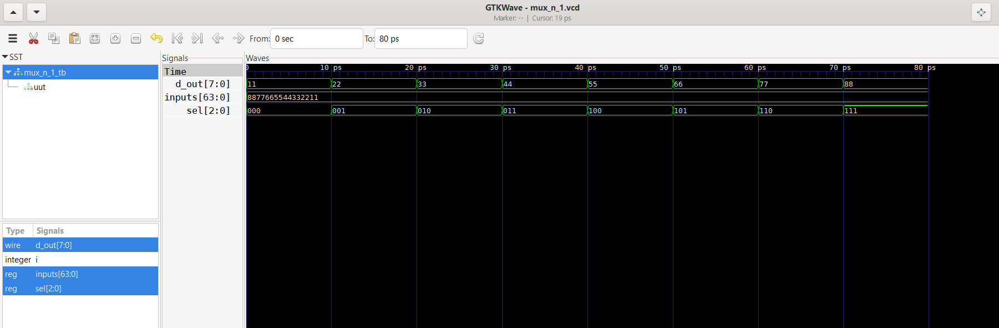

# Assignment 1 - N-bit MUX in Verilog

## Description
A parameterized N:1 Multiplexer with 8-bit width implemented in Verilog.
The number of inputs (N) can be changed using a single parameter without
modifying the design file.

## Files
- `mux_n_1.v` - N:1 MUX design file
- `mux_n_1_tb.v` - Testbench for simulation

## Module Details
| Parameter | Default | Description |
|-----------|---------|-------------|
| N | 8 | Number of inputs (must be power of 2) |

| Port | Width | Direction | Description |
|------|-------|-----------|-------------|
| inputs | 8*N bits | input | All N inputs packed |
| sel | log2(N) bits | input | Select line |
| d_out | 8 bits | output | Selected output |

## How to Run
```bash
iverilog -o mux_n_1 mux_n_1.v mux_n_1_tb.v
vvp mux_n_1
gtkwave mux_n_1.vcd
```

## Simulation Waveform


## Tools Used
- Icarus Verilog (simulation)
- GTKWave (waveform viewer)
